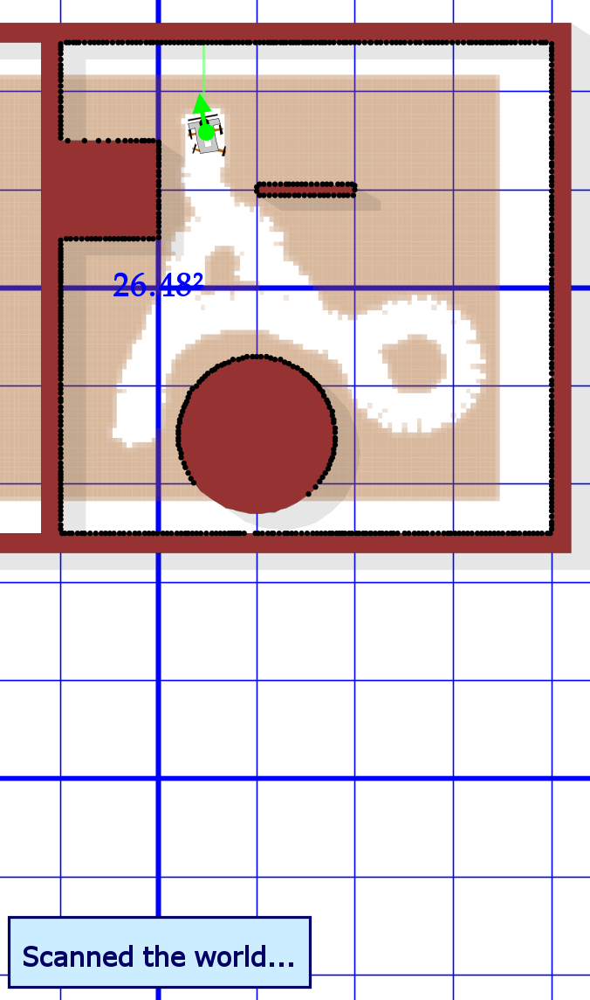
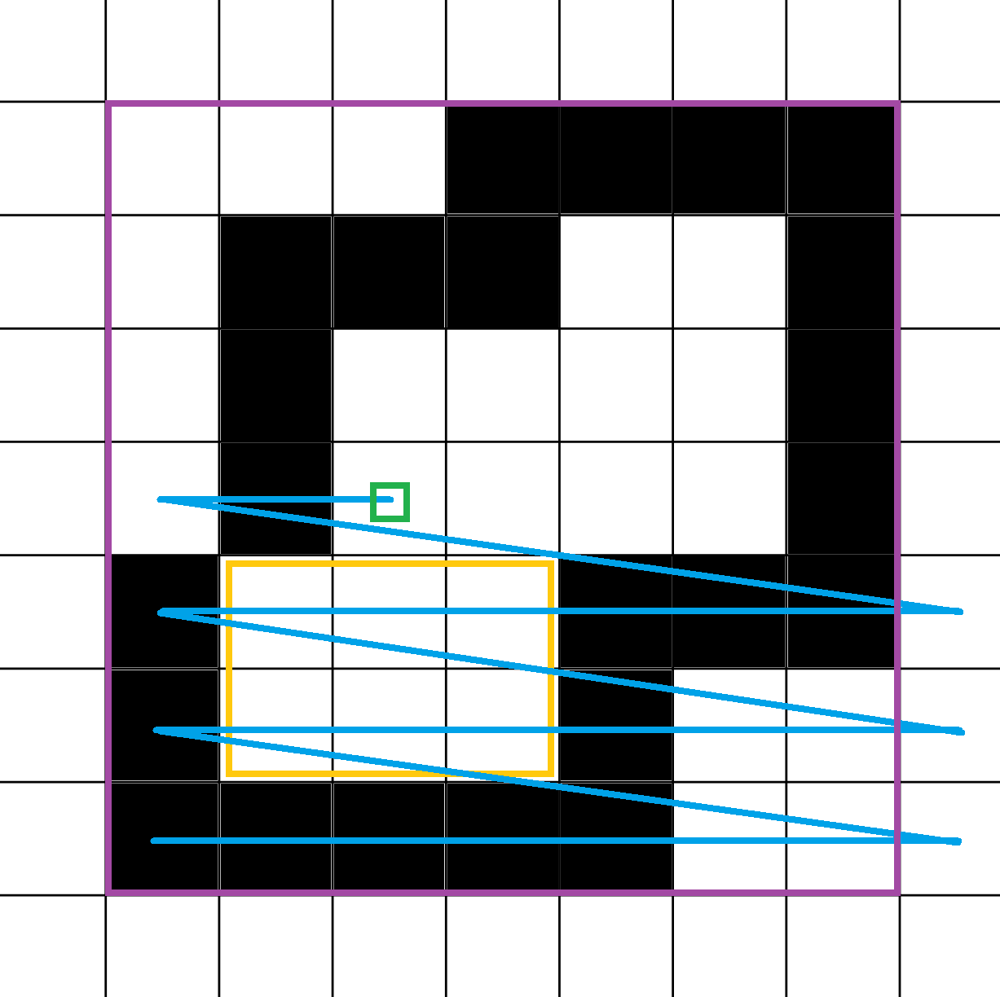
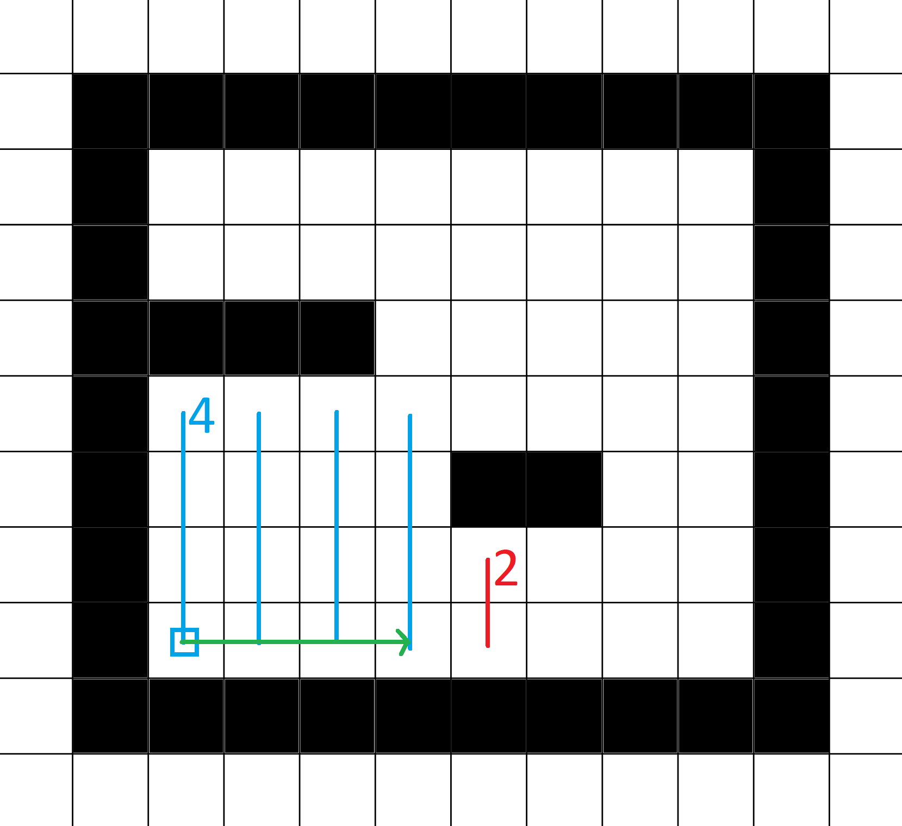
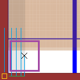
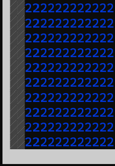
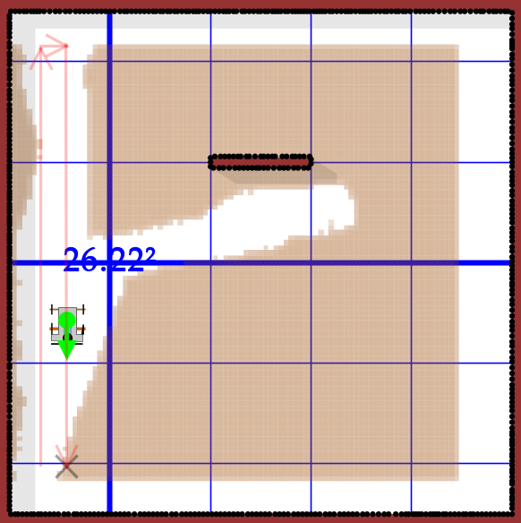

  <link rel="stylesheet" href="https://fonts.googleapis.com/css?family=Roboto">
  <link rel="stylesheet" type="text/css" href="style.css">

_(this is only available in German as it was a university project)_

# MyCarbot

Ein Roboter zur Reinigung von abgegrenzten Bereichen mithilfe einer Rechteck-Partitionierungs-Strategie.

Der Roboter wird hier nur mithilfe von Carbot simuliert, einem Forschungsprojekt von [Professor Jörg Roth](https://www.th-nuernberg.de/person/roth-joerg/) an der Technischen Hochschule Nürnberg Georg Simon Ohm.

[Mehr Informationen.](http://wireless-earth.org/carbot.html)

# Gliederung

- [1 Strategie](#strategie)
- [2 Theoretischer Ablauf](#theoretischer-ablauf)
  - [2.1 Initialer Welt Scan](#initialer-welt-scan)
  - [2.2 Nächstes Rechteck finden](#nächstes-rechteck-finden)
    - [Lückenbehebung](#lückenbehebung)
    - [Welt partitionieren](#welt-partitionieren)
    - [Startposition des Rechtecks finden](#startposition-des-rechtecks-finden)
    - [Dimensionen des Rechtecks finden](#dimensionen-des-rechtecks-finden)
    - [Rechteck auswählen](#rechteck-auswählen)
  - [2.3 Der Weg zum Rechteck](#der-weg-zum-rechteck)
  - [2.4 Rechteck reinigen](#rechteck-reinigen)
- [3 Beispielhafter Ablauf](#beispielhafter-ablauf)
- [4 Überblick über den Code](#überblick-über-den-code)
- [5 Probleme des Ansatzes](#probleme-des-ansatzes)
  - [5.1 Zweigeteilte Räume](#zweigeteilte-räume)
  - [5.2 Sehr viele kleine Hindernisse](#sehr-viele-kleine-hindernisse)

# 1 Strategie

Die Strategie wurde grundlegend in zwei separate Probleme unterteilt, die separat und nacheinander abgehandelt werden. Schritt eins ist ein Abscannen der kompletten Welt oder zumindest großen Teilen davon. In Schritt wird die Welt in Rechtecke eingeteilt, die nacheinander befahren und gereinigt werden.

# 2 Theoretischer Ablauf

Der genaue Code wird hier nicht erklärt, dafür ist die Dokumentation im Code selbst gedacht. An dieser Stelle soll nur ein grober Überblick über das Verhalten in verschiedenen Situationen und den generallen Ablauf gegeben werden.

## 2.1 Initialer Welt Scan

Schritt eins wird erreicht, indem der Carbot möglichst weit aus der Welt navigiert wird. Die automatische Routenplanung sorgt dafür, dass alle Außengrenzen der Welt erkannt werden, weil nur so sichergestellt ist, dass es nicht doch noch einen Weg aus den Außengrenzen heraus zum Punkt außerhalb der begrenzten Welt gibt. Kleinere Lücken bei der Erkennung sind dabei in Ordnung.

| Beispiel                                      | Erklärung                                                                                                                          |
| --------------------------------------------- | ---------------------------------------------------------------------------------------------------------------------------------- |
|  | Roboter sucht erst einen Weg links um den Kreis, dann rechts um den Kreis und dann oben, bis er die Oberseite des Quadrats findet. |

## 2.2 Nächstes Rechteck finden

Dieser Schritt ist nicht so einfach, daher Aufteilung in Unterschritte:

### Lückenbehebung

Hier werden kleine vertikale und horizontale Lücken in der Wand behoben, um Fehler bei der Planung zu reduzieren. Außerdem werden die Ecken kleiner Hindernisse ergänzt, um die Zahl kleinerer gefundener Rechtecke zu vermindern.

Dieser Schritt wird auch vor jeder Partitionierung durchgeführt.

`testFixGrid()`

| Vorher                                           | Nachher                                         |
| ------------------------------------------------ | ----------------------------------------------- |
|  |  |

### Welt partitionieren

`testPartitioning()` / `testRepartitionOnObstacle()`

Hier wird erst die bekannte Welt gelöscht (abgesehen von den Außengrenzen, Hindernissen und als "done" markierten Bereichen). Dann wird neu partitioniert und das erste Rechteck wird als nächstes Ziel zurückgegeben.

| `testPartitioning()`                              | `testRepartitionOnObstacle()`                            |
| ------------------------------------------------- | -------------------------------------------------------- |
|  |  |

### Startposition des Rechtecks finden

Um ein Rechteck für die Partitionierung zu finden wird erst eine Startposition gesucht. Diese muss als "dirty" markiert sein und innerhalb der befahrbaren Welt liegen. Jede Koordinate mit unendlich Platz in eine der vier Richtungen wird als out-of-world angesehen. Danach wird die erste "dirty" Zelle von unten links genommen:

| Visualisierung                                                     | Erklärung                                                                                                                                                                                |
| ------------------------------------------------------------------ | ---------------------------------------------------------------------------------------------------------------------------------------------------------------------------------------- |
|  | **Lila:** Außengrenzen des Grids.<br> **Blau:** Pfad von unten links der nacheinander abgelaufen wird. <br>**Gelb:** Existierendes Rechteck. <br>**Grün:** Gefundene Startposition. <br> |

### Dimensionen des Rechtecks finden

Es wird bei der Startposition begonnen und die Distanz nach oben gemessen (im Beispiel 4). Danach wird spaltenweise weitergesucht, bis entweder die Wand erreicht wird oder wie im Beispiel die gemessene Distanz nach oben weniger ist als die "Zieldistanz".



### Rechteck auswählen

Hier wurde nur ein rudimentärer Ansatz implementiert, bei dem das erste befahrbare Rechteck (mindestens eine Höhe und Breite von 2) zurückgegeben wird. Hier könnte als Ausblick ein intelligenterer Algorithmus implementiert werden, der Routen zu den jeweiligen Startpunkten plant und das Rechteck mit der kürzesten Route zurückgibt. Dadurch würden auch ein zweigeteilter langer vertikaler Raum besser abgehandelt werden als bisher.

## 2.3 Der Weg zum Rechteck

Erst fährt der Roboter zum Zentrum des Rechtecks. Dadurch ist sichergestellt, dass er freie Bahn zur unteren linken Ecke hat. Im Anschluss fährt er zur unteren linken Ecke, welche im Normalfall zu weit in der Wand ist. Um dennoch einen Startpunkt zu finden wird iterativ versucht, so nah wie möglich zu kommen ohne in der Wand stecken zu bleiben.

| Visualisierung                                             | Erklärung                                                                                                                                                                                                                                                                        |
| ---------------------------------------------------------- | -------------------------------------------------------------------------------------------------------------------------------------------------------------------------------------------------------------------------------------------------------------------------------- |
|  | **Orange:** Idealler Startpunkt. <br>**Blau:** Möglicher Startpunkt wird n mal oben verschoben bis es klappt.<br>**Grün:** War eine Spalte nicht erfolgreich, dann nächste Spalte probieren. <br>**Lila:** Dimensionen des Roboters. <br>**Schwarz:** Gefundener Startpunkt.<br> |

Spalten, die nicht verwendet werden konnten (im Beispiel die ersten vier) werden als "done" markiert und für weitere Rechtecksplanung mit Hindernissen gleichgesetzt. Danach wird neu partitioniert.

<figure>
  
  <figcaption>fig 1: Spalte wurde als "done" markiert</figcaption>
</figure>

## 2.4 Rechteck reinigen

An sich ein triviales Problem, wenn der Roboter nicht daran scheitern würde gerade Linien zu fahren (siehe Screenshot). Den Roboter mittels einer manuellen TrajectorySequence auf eine gerade Bahn zu schicken geht leider nicht, da der Roboter ab und zu trotzdem vom Weg abkommt und in die Wand fährt. Aus diesem Grund musste die normale Langstrecken-Routenplanung verwendet werden, die aber mit einer willkürlichen Richtung los fährt. Eine korrekter Startwinkel kann auch mit entsprechenden Parametern nicht garantiert werden. Daher wurde eine initiale Drehung mit einer manuellen Trajectory Sequence erzwungen.



Wurde eine Rechteck-Spalte gereinigt, wird sie im Grid als "done" markiert (vgl. fig 1). Ist ein Rechteck fertig gereinigt, wird das nächste Rechteck gesucht.

# 3 Beispielhafter Ablauf

Der idealle Ablauf einer Reinigung kann mithilfe der `CleaningPlannerTest` Klasse getestet werden (zusammen mit den anderen Funktionalitäten).

<figure>

<figcaption>Screenshot aus der Simulation</figcaption>
</figure>

# 4 Überblick über den Code

Da ich Visual Studio Code nutze und ein eigenes IDE Script gebaut habe, das für meine Java, JavaFX etc. Pfade angepasst habe, ist im .zip Archiv der Standard Batchfile aus dem Starterpaket.<br>

**Hier ein grober Überblick über die Klassenstruktur:**

```java
/**
 * Der Robotcontroller.
 * Kümmert sich darum, dass der Roboter möglichst fehlerfrei und ohne durch Wände zu glitchen ans Ziel gelangt.
 * Wichtige Funktionalitäten:
 * - Welt abscannen
 * - Zum Startpunkt eines Rechtecks fahren
 * - Rechteck reinigen
 */
class MyCarbot {}

/**
 * Managed das Grid und plant allgemein die high-level Cleaning Strategie.
 * Wichtige Funktionalitäten:
 * - Hindernisse ins Grid eintragen
 * - Grid in Rechtecke partitionieren
 * - Nächstes Rechteck finden
 * - Bereiche im Grid markieren
 * - Grid ins Terminal ausgeben
 */
class CleaningPlanner {}

/**
 * Eine Test-Runner, um einzelne Funktionalitäten des CleaningPlanners zu testen,
 * ohne den Simulator zu starten und mit der Möglichkeit, Breakpoints zu setzen.
 */
class CleaningPlannerTest {}

/**
 * Hilfsklasse: Ein generisches Rechteck mit ein paar Zusatzfunktionen,
 * um Koordinaten zwischen grid<->world umzurechnen.
 */
class MyRectangle {}


/**
 * Hilfsklasse: Ein MyRectangle mit einer zusätzlichen ID.
 */
class CleanableRectangle {}

/**
 * Hilfsklasse: Ähnlich zu MyRectangle, bildet aber nur die Außengrenzen ab.
 */
class Bounds {}

/**
 * Hilfsklasse: Konvertierung von grid<->world Koordinaten.
 */
class GridUtils {}

/**
 * Hilfsklasse: Farbige Konsolenausgaben, einheitliche print() Funktionen für Tests & Simulator.
 */
class LogUtils {}
```

# 5 Probleme des Ansatzes

## 5.1 Zweigeteilte Räume

Schmale vertikale zweigeteilte Räume mit vielen kleinen Hindernissen führen dazu, dass `nextRectangle()` oft aufgerufen wird. Bei optimaler Platzierung der Hindernisse fährt der Roboter abwechselnd zu einem Hindernis auf der linken/rechten Seite des Ganges.

Ein möglicher Lösungsansatz wäre hier, das nächste Rechteck basierend auf der Distanz zum Roboter zu wählen. Distanz ist hierbei die Distanz der geplanten Route, nicht Luftlinie.

## 5.2 Sehr viele kleine Hindernisse

Viele kleine Hindernisse, die versetzt angeordnet sind führen dazu, dass die gebildeten Rechtecke sehr klein werden. Der optimale Weg (die Welt in schrägen Bahnen abzufahren) wird nicht erkannt.

Hier gibt es mit einer Rechteck-Partitionierungs-Strategie keinen wirklichen Lösungsansatz. Statt Rechtecken könnten hier evtl. auch 45°-Schrägen über das Grid gelegt werden, aber wahrscheinlich ist ein grundlegend verschiedener Ansatz hier die bessere Wahl.
